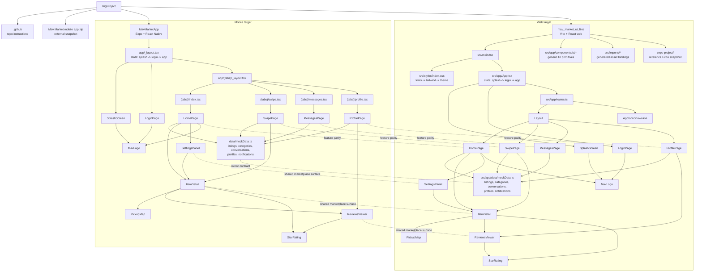

# AXON Graph

README-derived architecture graph for `RigProject`, written in an Axon-style node/edge view and validated against the current route/component imports.

## Scope

- Source of truth: root `README.md` plus the folder READMEs under `MavMarketApp/` and `mav_market_ui_files/`
- Code validation: root app entrypoints, router files, and key feature component imports
- Purpose: give a fast structural view of the repo before deeper code-level indexing

## Visual Graph

## Axon-Style Relationship Map

| Relationship | Examples in this repo |
|---|---|
| `CONTAINS` | `RigProject -> MavMarketApp`, `RigProject -> mav_market_ui_files`, `mav_market_ui_files -> src/app/components/ui/*` |
| `BOOTSTRAPS` | `src/main.tsx -> src/app/App.tsx`, `app/_layout.tsx -> SplashScreen/LoginPage/Slot` |
| `ROUTES_TO` | `app/(tabs)/index.tsx -> HomePage`, `routes.ts -> Layout/HomePage/SwipePage/MessagesPage/ProfilePage` |
| `USES_DATA` | `HomePage -> mockData.ts`, `MessagesPage -> mockData.ts`, `ProfilePage -> mockData.ts` |
| `OPENS_OVERLAY` | `HomePage -> ItemDetail`, `HomePage -> SettingsPanel`, `SwipePage -> ItemDetail`, `ProfilePage -> ReviewsViewer` |
| `COMPOSES` | `ItemDetail -> PickupMap`, `ItemDetail -> ReviewsViewer`, `ReviewsViewer -> StarRating` |
| `STYLES_WITH` | `src/main.tsx -> src/styles/index.css -> fonts.css/tailwind.css/theme.css` |
| `MIRRORS` | `MavMarketApp/data/mockData.ts <-> src/app/data/mockData.ts`, feature screen parity across mobile and web |
| `INFRASTRUCTURE` | `mav_market_ui_files -> src/app/components/ui/*`, `mav_market_ui_files -> src/imports/*` |

## Key Nodes

| Node | Type | Role |
|---|---|---|
| `RigProject` | Repository | Umbrella repo holding two parallel Mav Market implementations |
| `MavMarketApp` | AppTarget | Primary Expo/React Native mobile target |
| `mav_market_ui_files` | AppTarget | Parallel Vite/React web target and UI reference |
| `app/_layout.tsx` | FlowController | Mobile startup state gate |
| `src/app/App.tsx` | FlowController | Web startup state gate |
| `app/(tabs)/_layout.tsx` | Router | Mobile tab navigation definition |
| `src/app/routes.ts` | Router | Web route map |
| `HomePage` | FeatureScreen | Marketplace feed/search/discovery entry |
| `SwipePage` | FeatureScreen | Tinder-style browsing flow |
| `MessagesPage` | FeatureScreen | Conversations and in-thread messaging |
| `ProfilePage` | FeatureScreen | User profile, friend profile, reviews |
| `ItemDetail` | OverlaySurface | Listing detail sheet/modal |
| `SettingsPanel` | OverlaySurface | Settings/activity side panel |
| `ReviewsViewer` | OverlaySurface | Review modal/sheet |
| `PickupMap` | SharedComponent | Pickup location display |
| `StarRating` | SharedComponent | Reusable rating display |
| `mockData.ts` | DataStore | Shared local contracts and seed data |
| `src/app/components/ui/*` | UIInfrastructure | Generic web primitives, not marketplace-specific domain logic |

## Most Important Cross-Cutting Paths

1. App startup path:
   `SplashScreen -> LoginPage -> routed app`
2. Marketplace exploration path:
   `HomePage/SwipePage -> ItemDetail -> PickupMap + ReviewsViewer`
3. Shared data path:
   `mockData.ts -> listings, categories, conversations, profiles, notifications -> feature screens`
4. Cross-target parity path:
   mobile feature/data surfaces should remain aligned with their web equivalents

## Suggested Next Axon Expansion

- Add file-level dependency edges for each feature screen and overlay.
- Add domain entity nodes for `ListingItem`, `Conversation`, `UserProfile`, and `Notification`.
- Add behavior edges for state transitions such as `selectedItem`, login completion, and tab navigation.
- If you later run real Axon indexing, compare the generated call graph against this README graph to catch undocumented flows.
